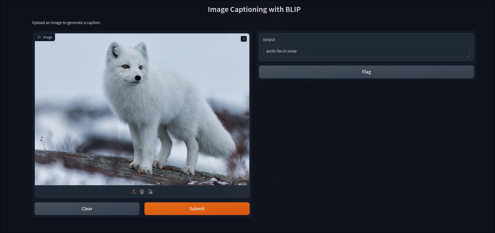

# Image Captioning with BLIP

This project is a simple image captioning web app built with [Gradio](https://gradio.app/), using the BLIP (Bootstrapping Language-Image Pretraining) model for generating captions based on uploaded images. The app processes images using the BLIP model from Hugging Face's `transformers` library and provides natural language captions for each image.

## Features

- **User-Friendly Interface**: Easily upload images and receive captions with a single click.
- **State-of-the-Art Model**: Uses the [BLIP image captioning model](https://huggingface.co/Salesforce/blip-image-captioning-base) developed by Salesforce.
- **Rapid Prototyping**: Powered by Gradio, making it simple to deploy and test.

## Example Screenshot




## Installation

To run this project, ensure you have the required libraries. Install them using pip:

```bash
pip install gradio transformers pillow
```

## Getting Started

To clone this repository and view my study notes, use the following command:

```bash
git clone https://github.com/ShrijithSM/Image-Captioning-AI.git
```
